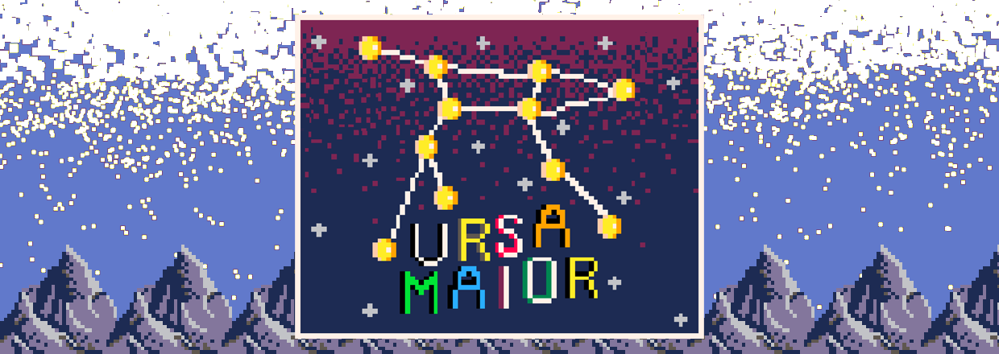
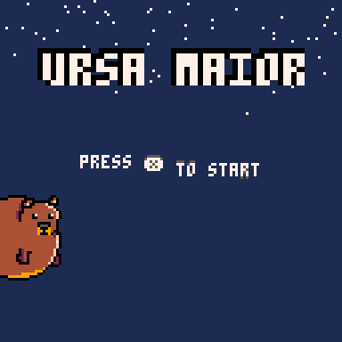
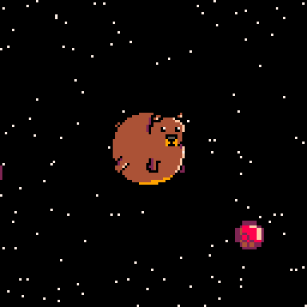
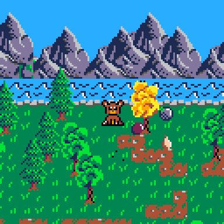

# Ursa Maior | Ludum Dare 52 Submission

 

Small narrative game created in PICO-8 for [Ludum Dare 52](https://ldjam.com/events/ludum-dare/52/ursa-maior). Tells an  alternate story about the birth of the Ursa Maior star constellation.
Enjoy!

## Controls
Arrow keys - Move the bear
(X) - Action key / Eat

## Credits
Zahkros - Game design, Music, SFX
bartalomew - Game design, Art
ekaktusz - Programming

Special thanks to: _Dzsodzso_ (helped with the art, website, and with basically everything) and for _koeves_ for the music.

